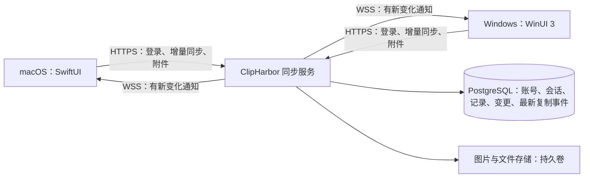

# ClipHarbor 自建服务器与实时剪贴板同步设计

版本：v0.3 设计与实现范围 · 日期：2026-10-06

本文保留产品行为和技术方案。用户已确定自建云端同步、自定义服务器和账号密码，以及跨设备直接使用系统快捷键粘贴；第一版包含文字、图片和普通文件。已加入两端原生设置与剪贴板接入、共用同步核心、ASP.NET Core 服务端、PostgreSQL、附件传输和 GitHub Actions 密码 SSH 部署。生产部署需要填写服务器配置；双设备交互仍需实际验收。

当前实现共用 C# 同步协议、SQLite 队列和传输逻辑；Windows 原生调用，macOS 的 SwiftUI / AppKit 通过私有父子进程管道调用随应用打包的组件，凭据由 Swift 写入 Keychain。草案中的设备列表界面、导入前容量汇总、自定义容量上限和全账号清空界面尚未加入；类型关闭期间保留元数据镜像，恢复后补齐内容。详细部署及验证方法见 [SERVER_DEPLOYMENT.md](SERVER_DEPLOYMENT.md)。

## 1. 目标与使用方式

用户在 macOS、Windows 的拾贴设置中填写同一服务器地址及同一账号密码，开启同步后，另一台在线电脑会自动收到复制内容并写入系统剪贴板。用户直接在目标应用按 macOS 的 `⌘V` 或 Windows 的 `Ctrl+V` 即可粘贴，无需打开拾贴或在历史中再次选择。

| 来源设备 | 操作 | 接收设备 | 直接粘贴 |
| --- | --- | --- | --- |
| Mac | `⌘C` 复制 | Windows | `Ctrl+V` |
| Windows | `Ctrl+C` 复制 | Mac | `⌘V` |
| Mac | `⌘C` 复制 | 另一台 Mac | `⌘V` |
| Windows | `Ctrl+C` 复制 | 另一台 Windows | `Ctrl+V` |

典型流程：Mac 复制一段文字 → 本机立即保存并发布复制事件 → 服务器通知 Windows → Windows 写入系统剪贴板 → 用户在聊天框、编辑器等目标应用按 `Ctrl+V`。

文件流程：Mac 在 Finder 复制 `报告.pdf` → 上传实际文件 → Windows 下载到拾贴缓存并写入文件剪贴板 → 用户在资源管理器的目标文件夹按 `Ctrl+V`，得到这份 PDF。反向流程一致，支持一次复制多个普通文件。

**“跨设备直接粘贴”默认开启，作为本方案的核心体验。** 此开关与现有“选择后自动粘贴”分别控制：接收端更新系统剪贴板，由用户自己按粘贴快捷键，应用不模拟输入、不切换窗口焦点。关闭此开关后，该设备继续同步历史，用户可以手动从历史复制。

实时直接粘贴要求两端应用正在运行、已登录同一服务器账号且网络可用。历史由服务器持久保存；离线或睡眠设备恢复后可补齐历史，历史补齐不会把旧内容自动写入当前剪贴板。文字及小体积图片在正常网络下的体验目标为约 1–2 秒内可粘贴；图片及文件需要等待附件传输和系统剪贴板写入完成，实际延迟以双设备测试为准。

服务器地址指兼容 ClipHarbor 同步协议的服务，例如 `https://clips.example.com`，并非任意网站、WebDAV 或数据库地址。账号由该服务器管理员创建。

## 2. 设置页面

macOS 设置增加“同步”页面；Windows 设置页面选择器增加“同步”。两端字段和行为一致，使用各自原生控件。

### 2.1 页面示意

```text
同步

服务器地址    [https://clips.example.com              ]
账号          [ariven                                 ]
密码          [••••••••                               ] [显示]
设备名称      [Ariven 的 MacBook                      ]
保持登录      [开启]

[测试连接]    [登录并连接]

状态：已连接 · ariven · clips.example.com
自动同步                    [开启]
同步文本与链接              [开启]
同步图片                    [开启]
同步文件                    [开启]
跨设备直接粘贴              [开启]

最近同步：今天 14:32
待上传：2 条 · 待下载图片：1 张
文件接收：报告.pdf · 3.2 / 8.0 MB
当前可粘贴：来自 Ariven 的电脑 · 文字 · 今天 14:32
[立即同步]    [退出登录]

已连接设备
Ariven 的 MacBook  · macOS   · 当前设备
Ariven 的电脑     · Windows · 最近在线：今天 14:30
```

### 2.2 字段与按钮行为

| 项目 | 建议规则 |
| --- | --- |
| 服务器地址 | 支持域名、IP、端口和部署子路径，如 `https://clips.example.com/clipharbor`；自动移除末尾斜杠；正式使用要求 HTTPS |
| 账号 | 去除首尾空格；账号大小写规则由服务器定义，登录后使用服务器返回的账号 ID |
| 密码 | 默认遮罩，支持粘贴和临时显示；保留原始输入，不裁剪空格；仅在登录时提交 |
| 设备名称 | 默认使用系统设备名，允许修改；只作为显示名称，不作为设备身份 |
| 保持登录 | 默认开启，安全保存刷新令牌；关闭时凭据仅保留在当前进程，重新启动后需要登录 |
| 测试连接 | 检查服务器身份、协议兼容性和连接状态；不提交密码、不上传历史、不启用同步 |
| 登录并连接 | 验证账号密码，建立该账号的设备会话；首次连接显示同步范围选择 |
| 自动同步 | 首次确认后开启；关闭后暂停上传和下载，已绑定当前账号的新记录进入本机待上传队列 |
| 同步文件 | 默认开启；控制实际文件传输，展示单文件、单批和缓存容量限制 |
| 跨设备直接粘贴 | 默认开启；控制本机是否自动把实时收到的远端复制内容写入系统剪贴板，关闭后继续同步历史 |
| 立即同步 | 手动补齐历史；暂停自动同步时也可使用，不把旧队列当作实时复制发布 |
| 退出登录 | 停止同步、关闭长连接、清除本机会话凭据；本机历史和服务器历史保留 |

服务器地址校验拒绝内嵌用户名密码、查询参数和 fragment。HTTP 仅限显式启用的 localhost 开发模式；自签名部署需配置系统信任的证书，不提供“忽略证书错误”开关。请求不得跨 origin 跟随重定向并携带凭据。

macOS 的配置可即时保存，Windows 保持现有“保存／取消”习惯。编辑连接字段属于草稿；“登录并连接”验证成功且用户完成首次范围选择后，才切换当前连接。普通“保存”不会把原账号令牌用于新地址。取消未提交的连接草稿不改变当前连接。

### 2.3 首次连接

首次连接某个“服务器＋账号”时，显示三个选项：

| 选项 | 行为 |
| --- | --- |
| 只同步连接后的新记录（默认） | 接收服务器已有历史；本机原有历史继续保留在本地 |
| 同时上传本机收藏 | 在上一项基础上，上传当前未绑定其他账号的本机收藏 |
| 同时上传本机全部历史 | 上传当前未绑定其他账号且符合同步类型的本机历史 |

确认前展示可上传条数、图片及文件容量；导入文件引用时检查原文件是否存在、是否可读及实际大小，失效或超限引用保留本地并反馈原因。连接测试、填写密码和登录成功本身均不会自动上传既有历史。

### 2.4 状态与反馈

状态包括：未配置、未登录、连接中、同步中、已同步、自动同步已暂停、等待网络、登录已失效、服务器不可用、协议不兼容、容量已满、部分内容同步失败。实时剪贴板另显示“正在接收”“已可粘贴”或“写入剪贴板失败”，只有系统写入成功后才显示“已可粘贴”。

网络故障使用页内状态反馈，保留正常本地使用；登录失效显示“请重新登录”；单张图片或单批文件失败可以重试，保留其他记录的同步。文件展示上传／下载字节进度，全部接收成功后提示“文件已可粘贴”；提前粘贴会得到之前的剪贴板内容，不拦截系统快捷键等待传输。成功接收时使用轻量状态提示，不弹出拾贴窗口、不抢焦点。状态时间按客户端所在时区显示。

## 3. 第一版同步范围

| 内容 | 同步方式 |
| --- | --- |
| 纯文本、链接 | 同步完整内容，实时复制事件自动写入接收端系统剪贴板 |
| RTF、HTML | 使用统一可选字段；目标平台支持时恢复格式，不支持时以纯文本复制 |
| 剪贴板图片、已缓存截图 | 上传图片实际字节及元数据；第一版交换格式为 PNG；只有真实剪贴板复制事件触发远端直接粘贴 |
| 收藏、备注 | 同步，按字段处理并发修改 |
| 来源设备、采集时间 | 同步并显示来源，避免无法区分远端记录 |
| 来源应用名称 | 第一版保留在本机；远端显示来源设备 |
| 普通文件、多个文件 | 同步实际文件字节；接收端缓存为本机文件并写入文件剪贴板，支持 Finder／资源管理器直接粘贴 |
| 图片文件引用 | 按文件传输，保留“复制文件”的语义；与截图／位图形式的图片分开处理 |
| 文件夹、符号链接、云盘占位及应用专用虚拟文件 | 第一版保留本机，提示类型暂不支持；普通文件包括可正常读取的 PDF、ZIP、Office 文档等 |
| 快捷键、排除应用、截图目录、保留策略 | 按设备保存 |
| 学习次数、使用次数、学习排除 | 第一版按设备统计和保存，接收远端记录不增加本机采集次数 |

原文件引用与已缓存图片需要区分：当前 macOS 的 `fileURLs`、Windows 的 `FilePaths` 指向本机文件，把路径传给另一台设备不能实现文件同步。文件同步新增发送快照缓存、实际字节上传和接收文件缓存；另一台设备的剪贴板只能引用它自己已经接收完整的本机文件。

截图目录出现新图片属于历史采集，不等于用户复制。此类记录加入另一台设备的历史，不自动覆盖其系统剪贴板；截图直接进入系统剪贴板、或用户在拾贴历史中主动复制图片时，才发布实时复制事件。

建议默认同步文本／链接、缓存图片和普通文件；用户可以分别关闭。类型开关按传输语义判断，PNG 文件引用属于“同步文件”，位图截图属于“同步图片”。关闭一种类型后，暂停该类型新内容的上传及接收，保留本机及云端已有内容；再次开启后补齐暂停期间仍保留的记录。

类型开关不改变服务器全局变更顺序：关闭期间可以略过该类型的新内容，但仍处理已同步记录的全局删除；重新开启后通过按类型快照补齐，避免全局游标已经推进导致漏项。该类型暂停期间的本机新记录保留账号归属，开启后仅上传仍保留且未删除的内容。

## 4. 日常行为与数据隔离

### 4.1 本地优先与离线

复制、收藏和备注修改先在本地持久化，再排队同步。断网、服务器重启和登录失效均不阻塞本地记录与搜索。待上传操作和所需附件独立于列表保留，在收到服务端确认之前持久保存；遇到本机队列容量限制，明确提示用户，不静默丢弃。

现有“暂停所有记录”继续控制本机采集；同步页面的“自动同步”控制网络同步。暂停采集期间仍可接收远端历史，用户可分别关闭这两个开关。

### 4.2 删除、清理和保留

| 操作 | 本机结果 | 同步结果 |
| --- | --- | --- |
| 删除一条纯本地记录 | 删除本机记录 | 无云端操作 |
| 主动删除一条已同步记录 | 删除并产生待同步删除操作 | 从当前账号所有设备删除；菜单显示“从所有设备删除” |
| 自动过期／数量清理／立即按策略清理 | 仅清理本机可见记录和可回收缓存 | 不删除云端和其他设备的记录 |
| 删除全部本地历史 | 清空本机列表，待上传及当前系统剪贴板引用的缓存继续保留 | 不批量删除云端；保留已提交待同步操作，并提示队列及当前剪贴板缓存仍占用空间 |
| 从所有设备清空历史 | 单独提供，确认时显示账号、服务器及是否保留收藏 | 删除服务器确认范围内的记录，并同步到其他设备 |

本机清理需保存账号范围内的隐藏标记，防止下次增量同步或全量重建立即把已清理记录重新显示。提供“恢复本机隐藏的云端历史”入口；全局删除优先于本机隐藏。

批量云端清空使用服务端快照范围及幂等操作 ID：清空确认后新产生的记录不被误删。服务器自己的过期清理属于全局删除，产生可同步的删除标记；云端保留期限与本机保留期限分别配置。

### 4.3 换服务器、换账号与退出登录

本机同步空间由规范化服务器地址、服务器实例 ID、账号 ID 共同确定。同步游标、令牌、记录归属和待上传队列均绑定此空间，不能只按账号名划分。

切换连接时先暂停旧连接，验证新连接，然后激活新空间。旧账号的缓存与队列保留在旧空间，并从当前历史视图隐藏；未绑定账号的纯本地历史仍可显示。旧账号数据不会自动上传到新账号。

退出登录后原空间已缓存的历史仍可离线查看，新采集的内容属于纯本地历史；重新登录同一空间可以继续其原有队列。上传退出期间的本地内容需要主动选择导入。离线退出先清除本机登录凭据并记录待撤销会话，恢复网络后用仅可撤销该会话的凭证完成远端注销；服务端会话到期也会终止访问。

### 4.4 实时直接粘贴链路

1. 来源端捕获一次真实复制，立即保存本机内容，生成独立 `clipboardEventId`；用户在拾贴历史中主动复制也走此路径。
2. 来源端先上传所需附件并提交历史操作，再向服务端发布实时剪贴板事件。文本走高优先级通道，不能等待一批历史、图片或文件上传完毕。附件完成后再检查来源端复制事件是否仍为最新，较旧事件只补齐历史，不再实时发布。
3. 服务端维护当前账号的“最新复制事件”，提交后分配独立的 `clipboardSequence`，通知其他在线设备；收藏、备注、导入和截图目录事件不更新此序号。
4. 接收端取得文字、图片或文件内容，在 macOS 使用 NSPasteboard、在 Windows 使用系统 Clipboard API 写入标准格式；图片写入前先下载完整、校验并解码，文件写入前需该批全部下载校验完成。
5. 系统剪贴板写入成功后显示“已可粘贴”。用户在目标应用直接按 `⌘V`／`Ctrl+V`，由目标应用按自身支持的剪贴板格式完成粘贴。

远端写入使用独立接口，不复用会增加本机学习使用次数、触发历史操作或模拟粘贴的代码。无论内容是否已存在历史，只要用户发生新的主动复制，仍生成实时事件，保证再次复制旧内容也能直接跨设备粘贴。

历史操作需要可靠重试；实时事件只服务当前在线复制。来源端断网时的复制进入历史队列，重连后补传为历史，不将旧复制队列依次发布为实时事件。通知丢失可通过查询最新复制事件补齐，但每次重连先建立基准水位，基准之前的内容不自动写入系统剪贴板。

### 4.5 防止循环、乱序和覆盖新复制

远端记录通过专用导入路径写入历史，不作为新的本机采集事件再次上传。远端剪贴板写入同时携带来源标记，并记录本机剪贴板变化编号及内容指纹，阻止监听器把同一次写入重新发布；不能仅凭相同内容永久忽略事件，因为用户可能主动再次复制它。

同一账号的实时事件按服务器提交顺序排序，接收端只考虑更新的 `clipboardSequence`。多条内容连续到达时，历史完整保存，系统剪贴板只采用最新可应用事件。较旧图片下载完成时，若已有更新事件，旧图片只加入历史。

每次开始接收时记录本机剪贴板变化编号；附件下载及处理完成后再次检查。如果此期间用户在本机发生了新的复制，就放弃该候选事件的自动写入，保留用户新复制的内容。较旧文件批次完成时，若已有更新事件，同样只保留历史。锁屏期间暂停系统剪贴板写入，恢复时建立新水位，旧事件只补齐历史。

复制来源与接收写入必须在两端都正确标记。用户在另一台电脑直接按系统粘贴快捷键不产生新的复制事件，因此不会导致两个设备反复回传。

## 5. 系统架构与建议技术栈



建议服务端使用 **ASP.NET Core＋PostgreSQL＋Docker Compose**，便于与现有 Windows C# 代码配合；部署时选择仍受支持的 LTS 运行时。客户端通过标准 HTTPS／JSON／WebSocket 通信，服务端语言不影响 Swift 接入。

第一版使用单实例服务、PostgreSQL 和本地持久卷保存图片及文件，前置 Caddy 或 Nginx 提供 TLS。后续需要多个服务实例时，再增加共享对象存储及跨实例通知。

HTTP 接口负责可靠读写。WebSocket 分别通知“历史有变化”和“新复制内容可接收”：历史按游标拉取，实时事件按独立的剪贴板序号处理。即使通知丢失，启动、重连、唤醒及定期补拉仍能恢复历史；在线会话内查询最新复制事件可补齐实时通知。通知发送必须在数据库事务提交之后执行。

## 6. 账号与凭据

第一版由管理员使用服务端 CLI 创建、禁用账号及重置密码，客户端提供登录入口；账号在不同服务器之间独立。

建议采用服务端可撤销的随机不透明令牌：访问令牌有效期 15 分钟，刷新会话最长 30 天，刷新时轮换令牌。令牌绑定账号和设备会话；退出、移除设备、禁用账号和重置密码可撤销对应会话。刷新令牌服务端仅保存哈希，刷新重试需设计短暂幂等窗口，避免网络丢包导致误判盗用。

密码仅通过 TLS 提交；服务端采用 Argon2id 和独立盐存储密码验证信息，并对登录尝试限流。账号不存在及密码错误统一反馈“账号或密码错误”。依据：[OWASP 认证指南](https://cheatsheetseries.owasp.org/cheatsheets/Authentication_Cheat_Sheet.html)、[密码存储指南](https://cheatsheetseries.owasp.org/cheatsheets/Password_Storage_Cheat_Sheet.html)。

macOS 使用 [Keychain Services](https://developer.apple.com/documentation/security/keychain-services)，Windows 使用 [Credential Manager](https://learn.microsoft.com/en-us/windows/win32/secauthn/credentials-management) 保存持久会话秘密。设置文件只保存服务器地址、账号显示名、设备名称及凭据引用，不保存密码或令牌。退出登录清除对应凭据；密码输入完成后从页面状态清除。

**第一版安全边界：HTTPS 保护传输，服务器管理员仍能读取同步内容。** 系统凭据存储保护的是登录秘密，不能据此宣称剪贴板内容已经端到端加密。端到端加密建议作为后续独立阶段，届时需要设备密钥、配对及恢复方案。界面首次启用需用一句明确文案说明内容会上传至用户填写的服务器。

所有记录、附件、设备和变更接口从会话确定账号，不信任请求体内的账号 ID；内容哈希也不能替代账号授权。正文、密码、令牌、HTML、RTF 和文件内容均不写入日志。

WSS 在原生客户端握手中使用 Authorization 请求头认证，不在 URL 中传递令牌；访问令牌到期或会话撤销后关闭连接，客户端刷新后重连。服务端限制连接数、消息大小和请求频率。依据：[OWASP WebSocket 安全指南](https://cheatsheetseries.owasp.org/cheatsheets/WebSocket_Security_Cheat_Sheet.html)。

## 7. 同步协议与合并规则

### 7.1 统一交换格式

当前 Swift 使用 `ClipItem`，C# 使用 `ClipRecord`，字段名、日期、枚举及富文本编码不同。新增独立的 `SyncRecord v1`，由两端适配本地模型，避免直接上传 `history.json`。

| 字段 | 规则 |
| --- | --- |
| `schemaVersion` | 固定为 `1`，用于数据格式升级 |
| `recordId` | UUID，同一同步记录跨设备保持一致 |
| `kind` | 小写枚举：`text`、`link`、`image`、`files` |
| `text` | 可选 UTF-8 文本，保留原文 |
| `rtfBase64`、`html` | 可选；RTF 原始字节用 Base64 表示；HTML 作为惰性数据保存，预览不执行脚本 |
| `blobId` | 图片附件 ID，禁止使用本地路径 |
| `files` | 文件清单：每项包含原文件名、字节数、SHA-256、附件 ID；不包含原电脑的绝对路径 |
| `contentHash` | 统一内容指纹，供去重使用；不包含备注、收藏和设备路径 |
| `capturedAt`、`lastCapturedAt` | UTC RFC 3339 时间，作为内容信息；不作为冲突判定依据 |
| `originDeviceId` | 服务端登记的来源设备身份 |
| `favorite`、`note` | 跨设备共享元数据 |
| `favoriteRevision`、`noteRevision` | 对应字段的服务器版本，用于检测并发修改 |
| `revision`、`deletedAt` | 服务器记录版本和删除状态 |

创建后正文和附件不可变；再次采集、修改收藏、修改备注和删除使用不同操作。内容指纹需定义固定字段顺序、UTF-8、长度前缀及空值规则，禁止各端直接对自身 JSON 序列化结果计算哈希。文本原文保留，指纹中的换行统一为 LF；富文本字段参与指纹，避免把格式不同的内容误合并。图片对交换用 PNG 字节计算 SHA-256，第一版不做视觉相似识别。文件记录按剪贴板清单顺序，对原文件名、大小和内容哈希计算指纹；原路径及平台缓存路径不参与去重。

### 7.2 可靠传输

每个本机操作包含 `operationId`、`deviceId`、递增的 `clientSequence`、目标记录及必要的字段版本。服务端按账号和操作 ID 幂等处理，回包给出逐项结果及规范记录 ID；重复请求不重复创建记录、不重复增加版本。

客户端持久保存待上传队列。服务端每个账号分配独立的、按事务提交顺序递增的变更序号；同一账号的变更分配串行化，避免较小序号迟提交而被游标漏掉。分页拉取固定到同一个已提交高水位，游标使用字符串／不透明值，避免跨语言大整数精度问题。

收到一页变化后，本机记录、删除标记和游标在同一事务中落盘，再推进下一页。旧操作重发、分页中断及进程崩溃后均可重试。操作身份索引第一版持久保留，不能因压缩变更日志而丢失幂等能力。

历史操作可在 300–500 ms 短窗口内合并；同一记录有依赖的操作依序提交，不同记录可独立推进。`clientSequence` 用于来源顺序和诊断，不以“所有较小序号必须已完成”阻塞无依赖操作。实时复制对应的内容提交优先处理，文件上传不得阻塞后续文字直接粘贴。网络错误按 1、2、5、10、30 秒上限加入随机抖动重试；429 尊重 `Retry-After`；登录失效只尝试一次刷新；协议错误、格式错误和容量限制显示原因，不无限重试。

### 7.3 重复内容和并发修改

| 场景 | 处理规则 |
| --- | --- |
| 两端独立采集相同内容 | 服务端按账号内内容指纹归并到活动记录，返回规范 ID；原 ID 保存为别名，后续操作解析到同一记录 |
| 同一设备再次采集已有内容 | 提交“再次采集”操作，更新最近采集信息，保留收藏和备注 |
| 两端分别修改收藏与备注 | 按字段版本判断，互不覆盖；收藏提交明确布尔值，不提交“切换”指令 |
| 两端修改同一字段 | 旧字段版本请求返回冲突及云端当前值；收藏采用云端当前值，用户可再次修改；备注保留本机草稿并提示选择内容后重提 |
| 一端删除，另一端修改 | 已删除的记录拒绝修改，删除优先；保留未上传备注草稿供用户取回 |
| 删除后真正再次复制同样内容 | 作为新采集生成新记录；旧记录及其别名不能通过重试重新激活 |

首次导入已有历史按“创建记录”处理：遇到活动重复记录保留云端收藏和备注，本机有差异的备注作为草稿保留；有差异的收藏提示用户手动处理。导入不伪装为新的实时采集事件，也不触发其他设备的系统剪贴板更新。

### 7.4 长期离线与全量重建

建议增量变更日志至少保留 30 天，删除 ID、别名及幂等身份索引第一版持续保留。客户端游标超出日志范围时返回 `410 CURSOR_EXPIRED`，转为分页下载当前快照。

快照具有稳定边界和结束游标，不与分页期间新变化混淆。客户端保留待上传操作和本机隐藏标记，完成快照后重新校验、提交队列，再从快照结束游标补拉新变化；已删除目标的旧操作不能变成创建操作。

服务器恢复旧备份或重建数据时必须更换 `syncEpoch`。客户端检测到 epoch 变化后暂停自动上传，显示恢复状态并重新建快照；原 epoch 的队列保留供人工恢复，不直接重放到新数据空间。

## 8. 建议接口草案

以下接口相对于用户填写的服务器地址拼接 `/api/v1`。协议版本独立于客户端应用版本；测试连接需验证产品标识、实例 ID 及支持的协议版本。

| 方法与路径 | 用途 |
| --- | --- |
| `GET /meta` | 无认证获取产品标识、实例 ID、协议版本及公开限制 |
| `POST /auth/login` | 提交账号、密码、设备名称和本机设备标识，获取设备会话 |
| `POST /auth/refresh` | 轮换访问及刷新令牌 |
| `POST /auth/logout` | 幂等撤销当前会话，支持离线后延迟注销 |
| `GET /account` | 获取账号 ID、同步 epoch、容量使用及账号限制 |
| `GET /devices` | 列出当前账号设备 |
| `PATCH /devices/{id}` | 修改设备显示名称 |
| `DELETE /devices/{id}` | 移除设备并撤销其会话 |
| `POST /sync/operations` | 批量提交创建、再次采集、收藏、备注及删除操作 |
| `GET /sync/changes?cursor=…&limit=…` | 分页拉取增量变化；返回下一游标、高水位及 `hasMore` |
| `GET /sync/snapshot?pageToken=…&kinds=…` | 分页获取稳定快照及结束游标；可按类型补齐，类型快照不推进其他类型的下载游标 |
| `POST /sync/clear` | 按确认的快照范围清空云端记录，可保留收藏；必须携带幂等操作 ID |
| `POST /clipboard/events` | 在当前在线会话发布用户主动复制事件，携带事件 ID、历史操作 ID 或规范记录 ID 及同步 epoch；返回剪贴板序号 |
| `GET /clipboard/latest` | 获取当前账号最新复制事件、剪贴板序号、来源设备及内容引用；作为实时通知补齐和新会话基准 |
| `POST /uploads` | 创建附件上传会话，携带类型、大小及哈希；预留配额，返回上传 ID 及分块大小 |
| `PUT /uploads/{id}/parts/{index}` | 幂等上传附件分块；限于当前账号和有效会话 |
| `GET /uploads/{id}` | 获取已收到的分块索引，支持中断后续传 |
| `POST /uploads/{id}/complete` | 验证完整大小、哈希及图片格式，生成可引用附件 ID |
| `DELETE /uploads/{id}` | 取消上传并释放配额及临时数据 |
| `GET /blobs/{id}` | 授权下载当前账号可访问的图片或文件；支持 Range 和稳定 ETag，用于续传 |
| `WSS /events` | 发送历史变化、实时复制事件通知、心跳及会话失效通知 |

登录响应至少包含 `accountId`、`deviceId`、`sessionId`、访问／刷新令牌、过期时间和只可用于注销该会话的延迟撤销凭证。`/meta` 返回的限制以登录后的账号限制为最终依据。

HTTP 401 表示会话失效，403 表示无权限，409 表示字段冲突或 epoch 不匹配，410 表示游标过期或目标记录已删除，413 表示内容过大，429 表示限流。错误统一为 `{ "code": "…", "message": "…", "requestId": "…" }`，不回显秘密或正文。账号容量不足使用明确业务码 `QUOTA_EXCEEDED`。

批量操作响应包含每个 `operationId` 的处理状态、规范记录 ID 和冲突字段；部分成功时仅移除已确认的队列项。上传回包中的服务器水位用于触发补拉，不能直接作为本机下载游标，否则会跳过其他设备变化。

实时复制事件独立于历史记录去重，携带 `clipboardEventId`、`clipboardSequence`、`originDeviceId`、`kind`、内容引用及服务器提交时间；同一事件重试不重复分配序号。来源端的事件发布必须引用已提交内容，接收端不能自动应用自己的事件。长连接建联时返回实时基准水位，与后续通知建立无间隙衔接。

## 9. 图片、文件、容量与部署

### 9.1 图片与共同附件规则

图片先上传成功，再提交引用该附件的记录和实时复制事件；下载端先接收元数据，显示“图片下载中”，附件校验及解码完成后写入系统剪贴板，显示“已可粘贴”。写入成功之前保留原系统剪贴板。图片失败独立重试，其他记录继续同步；待重试事件已过时或用户已在本机复制新内容时，仅恢复历史。

第一版附件统一使用分块上传和 Range 下载续传，建议每块 4 MiB；失败后只重传缺失块。服务器预留本次上传容量，成功完成后转为实际占用，过期或取消释放预留；幂等重试不重复扣减配额。暂停同步、退出登录及换账号时停止当前网络传输，未完成缓存及队列仍绑定原账号。

### 9.2 文件直接粘贴

| 步骤 | 行为 |
| --- | --- |
| 读取来源 | 识别 Finder 的文件 URL 或 Windows StorageItems，读取用户复制的普通文件；不把路径字符串当成文件内容 |
| 固定内容 | 在来源端复制到私有发送缓存，读取前后检查大小和修改状态；若文件正在变化或已不可读，提示失败而不发送不完整内容 |
| 上传 | 按文件清单上传实际字节；同账号相同内容可复用附件，但每次主动复制仍有独立实时事件 |
| 下载 | 按账号和传输 ID 创建私有接收目录，完整下载全部文件并校验大小及 SHA-256；临时 `.part` 文件不会进入系统剪贴板 |
| 写入剪贴板 | Mac 写入本机缓存文件 URL；Windows 写入本机缓存文件的 StorageItems，并指定 Copy 操作；不是文件名文本或下载链接 |
| 用户粘贴 | 在 Finder／资源管理器目标目录按 `⌘V`／`Ctrl+V`，由系统复制接收端缓存文件；同名覆盖及重命名遵循目标文件管理器的交互 |

一批多个文件全部接收成功后一次写入剪贴板，不能把部分成功的文件伪装成整批完成。接收结果始终是复制语义，不同步跨设备“剪切／移动”，不删除来源原文件。目标为聊天或文档应用时，是否接受文件由该应用本身决定。

第一版支持单个和多个普通文件，保持文件字节和可用文件名；不承诺保留 ACL、扩展属性、资源叉或可执行权限。文件夹、符号链接、macOS 应用包、未落盘云文件及应用提供的文件 promise 等保留在本机，并给出明确反馈；混合选择包含不支持项时不自动发送部分文件。

文件名在接收端经过安全映射：拒绝绝对路径、路径分隔符、`.`／`..`、NUL 及目录逃逸；按目标平台处理保留名称、非法字符、尾部空格／句点和长度限制。映射后碰到大小写或规范化重名时增加编号，保留扩展名，并在详情显示原名和接收名。Windows 命名限制依据：[Microsoft 文件与路径命名说明](https://learn.microsoft.com/en-us/windows/win32/fileio/naming-a-file)。

服务器及接收端以内部附件 ID 和私有目录存储内容，不使用上传原名直接拼接存储路径；传输内容不自动执行，ZIP 按普通文件传输，不自动解压。缓存需正常继承系统对下载文件的安全处理，不能借文件同步绕过系统检查。上传存储与路径规则参考：[OWASP 文件上传指南](https://cheatsheetseries.owasp.org/cheatsheets/File_Upload_Cheat_Sheet.html)。

### 9.3 缓存与容量

来源原文件保持引用语义，新增发送快照是同步专用缓存；删除记录不修改原文件。接收文件缓存与现有图片缓存分别管理，当前系统剪贴板引用、待上传或待接收内容需保持固定引用，不能被普通数量和过期清理提前删除。

系统剪贴板转为其他内容后解除该批缓存的剪贴板固定引用，再按本机保留策略清理；普通已解除固定引用的接收缓存建议至少保留 24 小时。退出登录、切换账号及正常退出应用也不能立即删除仍被系统剪贴板引用的文件，保证退出后尚在剪贴板中的文件仍可粘贴。缓存容量不足时拒绝新接收并保留原剪贴板，不悄悄清除当前引用的文件。

建议服务端初始默认值：单条文本／富文本交换内容合计不超过 2 MiB；单张 PNG 不超过 20 MiB；单个文件不超过 100 MiB，一批最多 100 个文件且总计不超过 500 MiB；每账号最多 10,000 条活动记录及 2 GiB 内容容量；普通云端记录保留 30 天，收藏免于时间清理但仍计入容量。客户端设置提供单文件、单批及本机缓存容量限制，默认本机同步缓存预算为 2 GiB；有效限制取本机和账号中较小的值，超限内容保留本机原引用并展示不同步原因。

容量统计包含正文、附件、分块临时文件、暂未关联的上传文件及待回收文件，预留配额和已用空间不能重复统计；变更日志和索引另外设置服务端空间预算。附件只在无活动记录引用、无待提交上传租约后回收，建议留 24 小时宽限期。当附件不再被该账号任何活动记录引用时，立即撤销其普通下载权限；共享同一附件的其他活动记录仍可正常访问。删除云端记录时同时让引用它的最新复制事件失效，不主动清空设备当前系统剪贴板。

### 9.4 部署

交付服务端时应包含：Dockerfile、Compose 配置、环境变量示例、数据库迁移、管理员 CLI、健康检查、反向代理示例及备份／恢复说明。备份覆盖数据库和附件一致性；恢复演练验证 epoch 更新。反向代理请求大小和超时需与分块协议一致。凭据通过文件或交互输入注入，避免出现在 shell 历史及命令行参数中。

## 10. 接入现有项目

| 位置 | 后续改造 |
| --- | --- |
| `Sources/SettingsView.swift` | 添加同步页、状态反馈及首次连接范围选择 |
| `Sources/ClipItem.swift` | 通过适配层关联统一同步记录，保留本机文件语义 |
| `Sources/ClipboardStore.swift` | 接入历史操作及真实复制事件；主动从历史复制也发布实时事件；拆分本机清理与全局删除，增加无回传的导入及系统剪贴板写入路径 |
| macOS 新同步模块 | 配置、Keychain、HTTP／WSS 客户端、队列、图片／文件传输、文件缓存及同步状态 |
| `windows/ClipHarbor.Core/AppSettings.cs` | 增加非秘密连接配置，凭据使用独立系统存储 |
| `windows/ClipHarbor.Core/HistoryStore.cs` | 接入同样的操作事件和账号隔离，区分记录来源与清理原因 |
| `windows/ClipHarbor.Windows/Services/ClipboardService.cs` | 捕获／主动复制时发布实时事件；新增不增加学习次数、不重新发布事件的远端系统剪贴板写入接口 |
| `windows/ClipHarbor.Windows/SettingsDialog.cs` | 添加原生同步设置页和设备列表 |
| Windows 新同步模块 | Credential Manager、网络客户端、队列、图片／文件传输、文件缓存与同步状态 |
| 新增 `server/` | 独立同步服务、迁移、CLI 和容器配置 |
| README、隐私及常用内容说明 | 根据同步开关说明本地保存及上传范围，保留“学习计算在本机完成”的准确表述 |

建议同步空间、记录投影、待上传队列和游标使用本机 SQLite 持久化，使内容变更与操作入队在同一事务提交。现有 JSON 历史迁移保留备份，纯本地使用继续可用；如继续输出 JSON，它只能作为可重建视图，不能承担同步事务的权威存储。

## 11. 实施顺序与验收

建议以“两端直接按系统快捷键粘贴”为首个端到端交付目标，再补齐历史管理能力：

1. 确定交换格式、账号隔离、复制事件与历史操作的区别；建立 Swift／C# 共用协议样例。
2. 实现服务端账号、文本同步、实时复制事件、设备会话及基础部署工具。
3. 接入两端同步设置、凭据存储和系统剪贴板写入，先完成 Mac 复制 → Windows `Ctrl+V`、Windows 复制 → Mac `⌘V`。
4. 接入图片、文件传输及直接粘贴，包括分块续传、缓存保护、清单映射；验证乱序、重复内容、循环抑制及本机新复制保护。
5. 完善收藏、备注、删除、快照、事务队列、唤醒恢复及本机清理隐藏标记，完成实际双设备验收。

验收至少覆盖以下行为：

| 场景 | 通过条件 |
| --- | --- |
| 自定义域名、IP、端口及子路径 | 测试连接和登录均命中配置目标，不意外拼接到域名根目录 |
| 账号密码错误、证书错误、协议不兼容 | 错误明确，无历史上传；原连接和本机功能仍正常 |
| Mac 与 Windows 双向直接粘贴 | Mac 复制后在 Windows 直接 `Ctrl+V`，Windows 复制后在 Mac 直接 `⌘V`；无需打开拾贴选择记录 |
| 同平台直接粘贴 | 两台 Mac 或两台 Windows 使用各自系统快捷键直接复制粘贴 |
| 文本、富文本与图片 | 在支持对应格式的聊天框、编辑器及文档应用验证真实粘贴结果；图片完整接收后才显示“已可粘贴” |
| 单个及多个文件双向粘贴 | PDF、ZIP、Office 文档及图片文件可在另一台电脑的 Finder／资源管理器直接粘贴，内容哈希一致 |
| 文件进度、原文件变化及不支持类型 | 未完整接收不显示“已可粘贴”；失败保留原剪贴板和来源文件，混合选择不静默漏项 |
| 文件续传与缓存保护 | 中断可继续；重复块不重复计费；本机清理、退出应用及账号切换不会使当前文件剪贴板立即失效 |
| 文件名映射与越界路径 | 中文、空格、平台保留名称及大小写冲突有可用结果；越界清单不能写入缓存目录之外 |
| 再次复制历史和相同内容 | 主动复制已有记录或重复文字仍能更新另一台电脑剪贴板 |
| 连续复制及异步附件 | 较旧图片／文件晚完成不能覆盖新文字；附件下载期间本机新复制得到保留 |
| 截图目录新文件 | 同步历史，但不自动覆盖另一台电脑的系统剪贴板 |
| 首次连接 | 默认不上传旧历史；用户选中的导入范围与实际上传一致 |
| 按类型暂停和恢复 | 其他类型继续同步；重新开启的类型不漏项，全局删除仍然生效 |
| 断网、睡眠、重启 | 内容与操作持久保存，恢复后无漏项、无重复操作 |
| 并发收藏、备注及删除 | 按字段合并，保留冲突备注，已删除记录不复活 |
| 自动清理与本机清空 | 其他设备记录保留，本机不会立即重新下载并显示 |
| 切换服务器和账号 | 旧令牌、队列和内容不会进入新空间 |
| 凭据和账号权限 | 设置 JSON、日志不含秘密；另一账号不能读取记录、附件、上传会话、变化或设备 |
| 图片／文件超限、容量不足 | 可见原因，其他内容可继续同步，重试不重复占用容量，不清除当前剪贴板缓存 |
| 跨设备直接粘贴开关 | 默认开启并写入系统剪贴板；关闭后只同步历史，接收不抢焦点，无两端回传循环 |
| 离线、锁屏及历史补齐 | 恢复后旧内容不自动覆盖当前剪贴板；建立新水位后新复制恢复直接粘贴 |
| 游标过期和服务器恢复备份 | 快照补齐正确，保留隐藏标记及未完成操作，epoch 变化阻止旧队列自动重放 |

界面与剪贴板行为需在实际 macOS 和 Windows 上验证；核心单元测试、协议样例和服务端集成测试不能替代设备验收。

## 12. 本次草案建议

第一版核心行为为：**自定义 HTTPS 服务器＋账号密码登录＋后台实时复制事件＋接收端自动写入系统剪贴板**。Mac 用 `⌘V`，Windows 用 `Ctrl+V`，两个方向都无需打开拾贴历史。

跨设备直接粘贴默认开启，第一版包含文本、链接、剪贴板图片，以及 Finder／资源管理器里单个或多个普通文件。附件完整接收后即可使用系统快捷键粘贴，历史同步作为配套能力保留。用户可按设备关闭自动写入；设备设置和学习统计按设备保存。端到端加密、文件夹传输、公开注册和网页管理控制台列入后续阶段。
